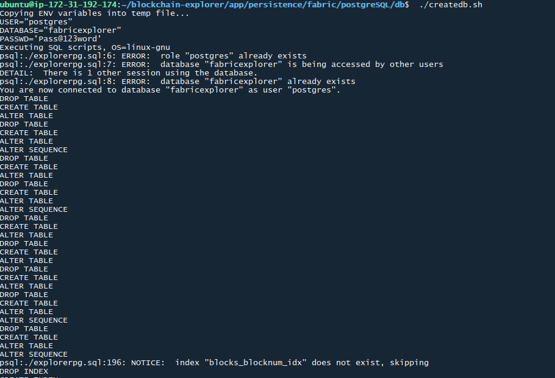
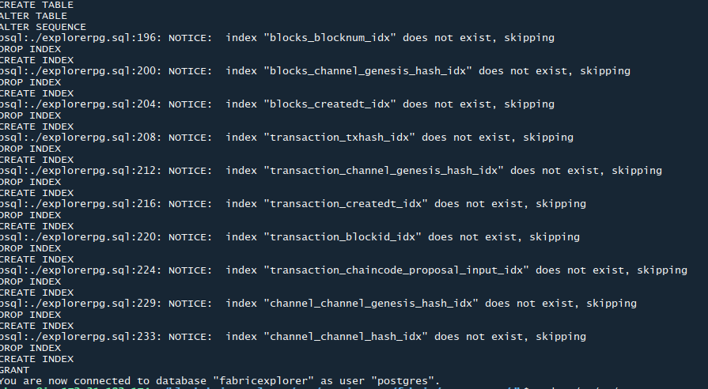
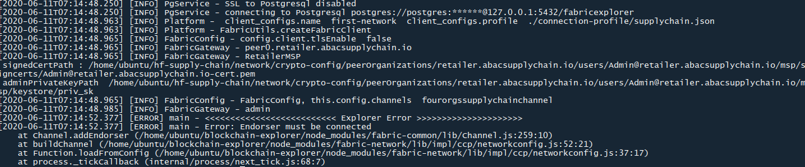
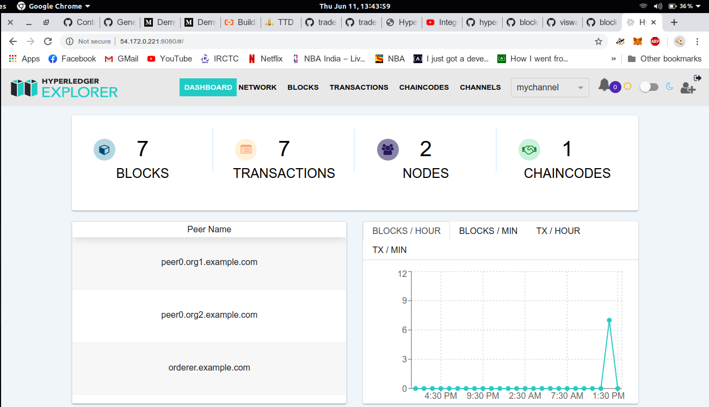

# Steps

- Create a directory `network`, `chaincode` and `application`
- `network` will have the network related settings
- Inside the `network` directory, create crypto-config.yaml and configtx.yaml
- `crypto-config.yaml` defines the participating organizations and peers
- `configtx.yaml` defines the MSPs, Anchor Peers, Network policies, Roles, consensus type and batch timeout/size
- `chaincode` will have the GO smart contracts code
- `chaincode` will have a java like folder structure `src/github.com/hf-supply-chain` where go contracts would reside

# Contract

- Creating an order
- Fulfilling an order via Producer, Shipper, Retailer at various stages
- An auditor to monitor the transparency

# Questions/General Info

- Read [this](https://github.com/hyperledger/fabric-contract-api-go/blob/master/tutorials/getting-started.md#writing-contract-functions) for data types
- Creating `enum` in go contract
- User Registration involves:

  1. Admin registering the user with a name, password(`optional`) and role
  2. Upon registering it returns the password/secret of the user. Secret will be same as step 1, if supplied during registration. Otherwise, a randomly generated secret would be assigned.
  3. Pass it on to the user and he/she needs to enroll the first time to get X509 certificates generated

  In short, admin registers user -> MSP provides access to the user -> user then requests certs using CSR(Certificate Signing Request). Separation of registering/enrolling is to make sure only the specific user has access to the signing certs.

- `TransactionContext` has the following methods:

  1. GetID()
  2. GetMSPID()
  3. GetAttributeValue(string)
  4. GetX509Certificate()

  Reference [here](https://github.com/hyperledger/fabric-contract-api-go/blob/master/contractapi/transaction_context_test.go)

- In Solidity, we have `Global State Variables` defined. Whenever a transaction executed, changes made to these are automatically stored to the ledger. However, in case of `Hyperledger Fabric`, this is approached differently. All those variables whose state needs to be maintained, should manually be updated using `ctx.GetStub().GetState` and/or `ctx.GetStub().PutState` within the smart contract itself.

- Peer vs Client
- AccessControl via NodeOUs
- Why AnchorPeers are needed?
- Solo Kafka Raft

# Crypto Config YAML

Base template for the YAML file can be found by:

```sh
cryptogen showtemplate
```

`crypto-config.yaml` will have the OrdererOrgs and PeerOrgs. Most configuration is simple except:

`EnableNodeOUs: true`

Firstly Node Organizational Units is a concept unique to Hyperledger Fabric 2.0. It allows to define four different roles in a MSP:

- admin
- peer
- client
- orderer

No additional customization is possible.

These roles are helpful in formulating policies for a network/consortium and/or channel/organization

Once you define the YAML file, try

```sh
cryptogen generate --config crypto-config.yaml
```

**Note:** The default value of `EnableNodeOUs` is `false`. In that case, only one generalized role called `member` is present. With enabling the attribute, the generated crypto material from `msp` folder will have a `config.yaml` specifying attributes.

# ConfigTX YAML

This will have organizations(be it peerOrgs/ordererOrgs) and their policies, Application and their policies, Channel and their policies. Also it defines orderer specific parameters such as consensus to be plugged in `SOLO/KAFKA/RAFT`, `BatchTimeout`, `BatchSize/MaxMessageCount`, `BatchSize/AbsoluteMaxBytes`.

A block is ordered when:

1. batch timeout is reached or
2. within the ledger close, max. message count is reached or
3. within the ledger close, max. message byte size is reached

## Policies

Policies are of two types:

1. ImplicitMeta
2. Signature

`ImplicitMeta` can only specify these keywords formulating policies - `ANY`, `ALL`, `MAJORITY`
Whereas `Signature` policy type gives more flexibility allowing to define `OR`, `AND`, `NOUTOF`

Refer [here](https://hyperledger-fabric.readthedocs.io/en/release-2.0/policies.html) and [here](https://hyperledger-fabric.readthedocs.io/en/latest/access_control.html)

Once `configtx` YAML is defined, generate genesis block using:

```sh
configtxgen --profile FourOrgsSupplyChainGenesis --outputBlock ./channel-artifacts/genesis.block --channelID fourorgssupplychainchannel --configPath $PWD
```

# Docker file for network setup/teardown

All you need to do now is attach all the crypto material generated to the docker containers, while properly attaching volumes and defining the names consistently as in the `configtx.yaml`

# Connecting via Blockchain Explorer

Check requirements:

- Nodejs 10 and 12 (10.19 and 12.16 tested)
- PostgreSQL 9.5 or greater
- jq

Clone via:

```sh
git clone https://github.com/hyperledger/blockchain-explorer
```

```
cd blockchain-explorer/app
nano explorerconfig.json
```

```
cd blockchain-explorer/app/persistence/fabric/postgresSQL/db
./createdb.sh
```

Check the screenshots for the logs.



Next

```sh
cd blockchain-explorer/app/platform/fabric/connection-profile
nano supplychain.json
```

Next

```
cd blockchain-explorer
rm logs/console/console.log

# One time dependencies install
./main.sh install
./start.sh
```

The `start.sh` has a weird behaviour of not displaying logs. It just prints this each time and exits:

```sh
************************************************************************************
**************************** Hyperledger Explorer **********************************
************************************************************************************
```

But you can check logs via:

```sh
cat logs/console/console.log
```

or

```sh
tail logs/console/console.log
```

Each time you restart the explorer with a different network/ca-certs:

```
cd blockchain-explorer
rm -rf wallet
./stop.sh

rm logs/console/console.log
./start.sh
```

The following error is displayed if the channel is not joined by peer:


More troubleshooting [at](https://github.com/hyperledger/blockchain-explorer/blob/master/TROUBLESHOOT.md)

# Fabcar network sample connection-profile for explorer

```json
{
  "name": "fabcar-network",
  "version": "1.0.0",
  "license": "Apache-2.0",
  "client": {
    "tlsEnable": false,
    "adminUser": "admin",
    "adminPassword": "adminpw",
    "enableAuthentication": false,
    "organization": "Org1",
    "connection": {
      "timeout": {
        "peer": {
          "endorser": "300"
        },
        "orderer": "300"
      }
    }
  },
  "channels": {
    "mychannel": {
      "peers": {
        "peer0.org1.example.com": {}
      },
      "connection": {
        "timeout": {
          "peer": {
            "endorser": "6000",
            "eventHub": "6000",
            "eventReg": "6000"
          }
        }
      }
    }
  },
  "organizations": {
    "Org1": {
      "mspid": "Org1MSP",
      "peers": ["peer0.org1.example.com"],
      "fullpath": true,
      "adminPrivateKey": {
        "path": "/home/ubuntu/fabric-samples/test-network/organizations/peerOrganizations/org1.example.com/users/Admin@org1.example.com/msp/keystore/5fc7e741ff718e74647d19241f539602b11e5dcca3d010aa6f9016b73bc7a5ac_sk"
      },
      "signedCert": {
        "path": "/home/ubuntu/fabric-samples/test-network/organizations/peerOrganizations/org1.example.com/users/Admin@org1.example.com/msp/signcerts/cert.pem"
      }
    }
  },
  "peers": {
    "peer0.org1.example.com": {
      "url": "grpcs://localhost:7051",
      "tlsCACerts": {
        "path": "/home/ubuntu/fabric-samples/test-network/organizations/peerOrganizations/org1.example.com/peers/peer0.org1.example.com/tls/ca.crt"
      },
      "grpcOptions": {
        "ssl-target-name-override": "peer0.org1.example.com",
        "hostnameOverride": "peer0.org1.example.com"
      }
    }
  }
}
```

This connection profile is not exhaustive, in the sense even though the `Org1` has other entities like `orderer`, `certificateAuthority` and a different organization `Org2`, they are all omitted.

## Things to keep in mind

- Do not include `.pem` key text directly for tlsCaCerts. Inlcude full path only.
- Mandatorily include `adminPrivateKey`, `signedCert`

The above points are stressed as they differ from the git repo description. Upon further inspection, `balance-transfer` example might be where you want to look at.

The more unnecessary info you include the more you suffer debugging.

**Note** Albeit fabric explorer page says HF1.4 is _only_ supported. It is displaying the block and transaction hash information.

If everything works, the blockchain explorer would look like:
